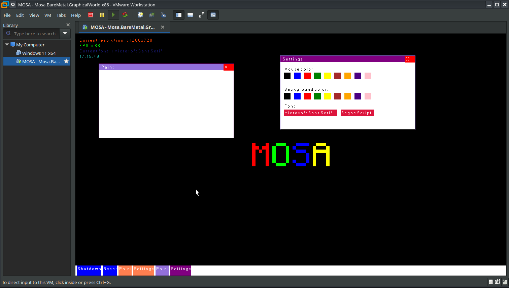
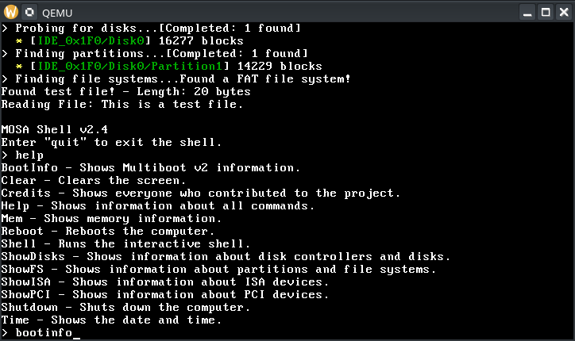

#####
Demos
#####

MOSA includes three demos applications to demostrate various capabilities of the MOSA project.

.. tip:: You can start any demo by launching its respective script in the Demos folder.

GraphicalWorld
=========

The **GraphicalWorld** demo uses, as its name would suggest, the GPU and some other features offered by MOSA to make a nice, graphical demo.

HelloWorld
==========

The **HelloWorld** demo is the classic rendition of `"Hello, World!" <https://en.wikipedia.org/wiki/%22Hello,_World!%22_program>`__, except it does not actually display those words. Instead it implements a basic shell with a few basic commands, like boot information, memory usage, and device information.

