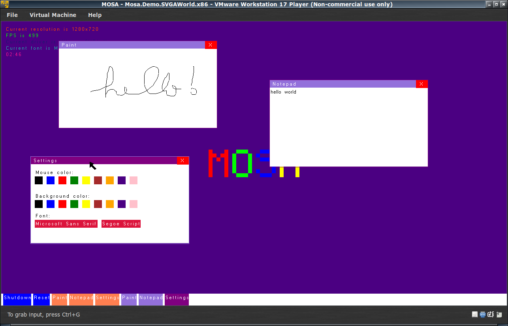

#####
Demos
#####

MOSA includes three demos applications to demostrate various capabilities of the MOSA project.

.. tip:: You can start any demo by launching its respective script in the Demos folder.

HelloWorld
==========

The **HelloWorld** demo is the classic rendition of `"Hello, World!" <https://en.wikipedia.org/wiki/%22Hello,_World!%22_program>`__, except it does not actually display those words. Instead it displays basic information hardware information, such as the BIOS information, the CMOS time, and the Multiboot memory map.

.. image:: images/mosa-demo-helloworld.png

TestWorld
=========

The **TestWorld** demo performs version simple, basic tests to validate the compiler, runtime, and kernel functionality.

.. image:: images/mosa-demo-testworld.png

CoolWorld
=========

The **CoolWorld** demo utilitizes the MOSA device drivers system to enumerate hardware devices and instantiate drivers, such as for the IDE controller, disk devices, and FAT file system.

.. image:: images/mosa-demo-coolworld.png

SVGAWorld
=========

The **SVGAWorld** demo uses the VMware SVGA II driver for graphics, and uses multiple other features (similar to the ones used by **CoolWorld**) offered by MOSA to make a nice demo.

