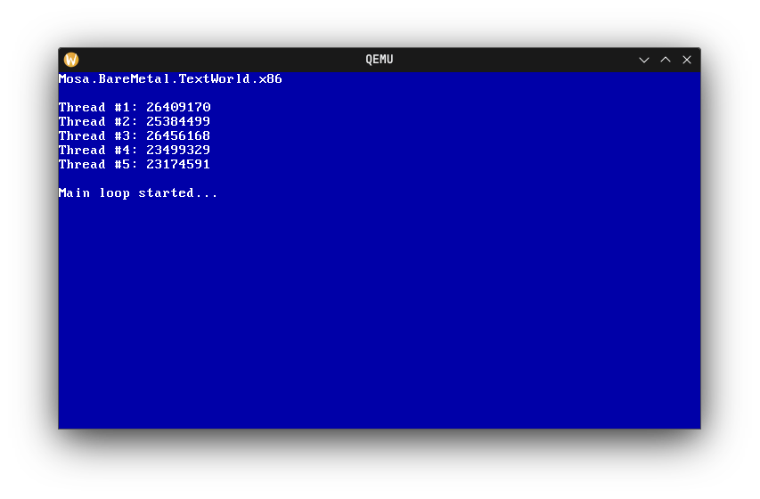

#####
Demos
#####

MOSA includes three demos applications to demonstrate various capabilities of the MOSA project.

.. tip:: You can start any demo by launching its respective script in the Demos folder.

CoolWorld
=========

It uses the GPU and some other features offered by MOSA to make a nice graphical demo.

.. image:: images/mosa-demo-coolworld.png

HelloWorld
==========

It implements a basic shell with a few basic commands, like boot information, memory usage, and
device information.

.. image:: images/mosa-demo-helloworld.png

TestWorld
=========

It's primarily used for testing and debugging, and thus doesn't serve any practical purpose other than finding bugs in
the MOSA compiler for example.

Starter
=======

It's used as a simple demo template project (just like the templates on NuGet), except it's directly bundled within the
MOSA solution.

