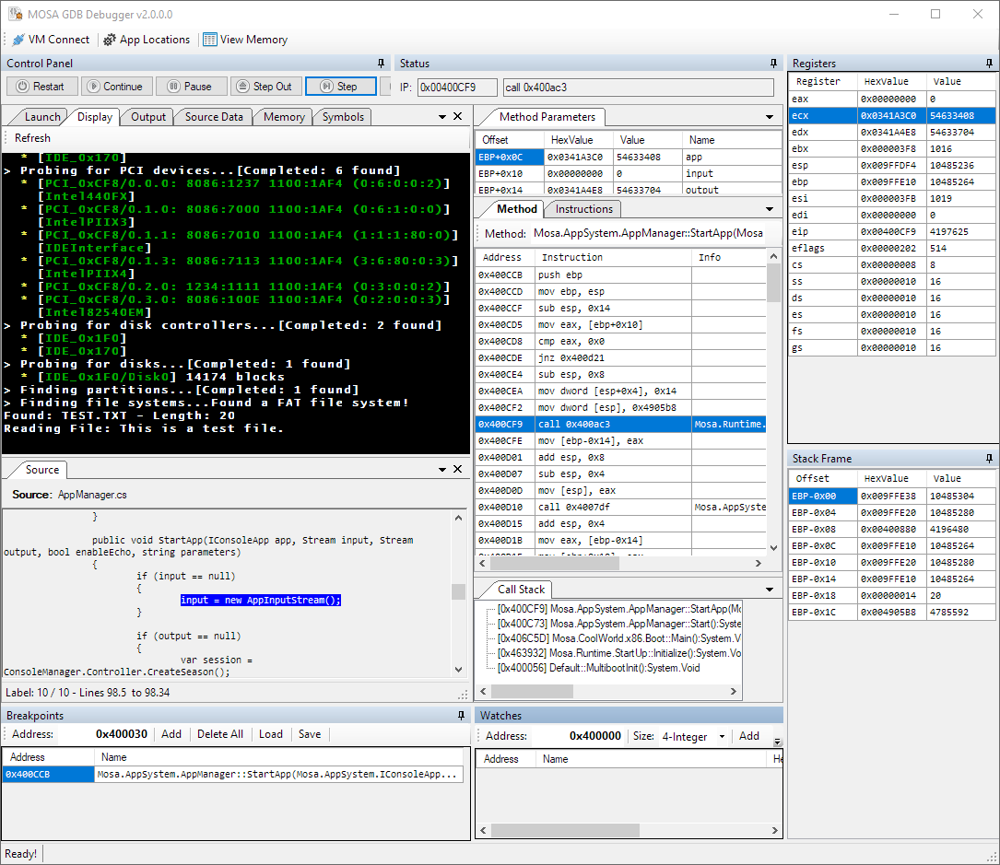

########
Debugger
########

The **MOSA Debugger** is GUI application used to debug a MOSA compiled application using `QEMU <https://www.qemu.org>`__.

Features
--------------------

* Breakpoints
* Watchpoints
* Register View
* Stack Frame View
* Call Stack View
* Method View
* Source Code View
* Method Parameters View
* Memory Views

Under the hood, **MOSA Debugger** utilitizes the QEMU virtual machine emulator and controls it with native GDB commands.

Usage
------

The **MOSA Debugger** can be launched by executing ``Mosa.Tool.Debugger``.

In addition, the tool can be launched from the command line with arguments:

.. code-block:: text

	Mosa.Tool.Debugger Mosa.BareMetal.HelloWorld.x86.dll

Command Line Options
--------------------

See the :doc:`command line arguments<command-line-arguments>` for a list of available options.
