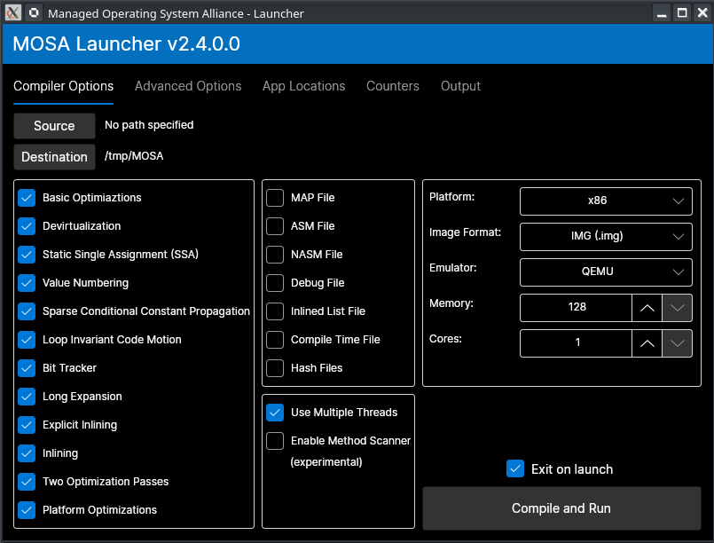

########
Launcher
########

The **MOSA Launcher** is GUI application used to select various compiler and build options. Once options are selected, the tool automates the entire build process including launching a virtual machine.

.. tip:: Check out the :doc:`console launcher <tool-launcher-console>` for a console version of this tool.

Usage
-----

The **MOSA Launcher** can be launched by executing ``Mosa.Tool.Launcher``.

In addition, the tool can be launched from the command line with arguments:

.. code-block:: text

	Mosa.Tool.Launcher Mosa.BareMetal.HelloWorld.x86.dll

Command Line Options
--------------------

See the :doc:`command line arguments<command-line-arguments>` for a list of available options.
